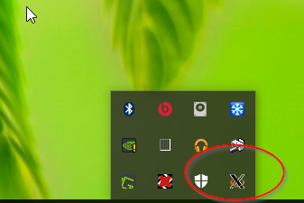
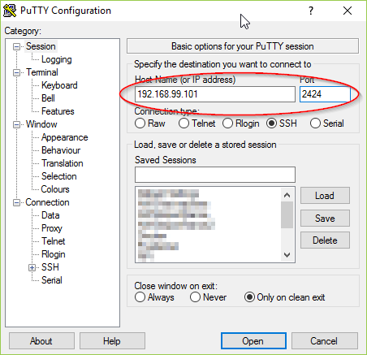
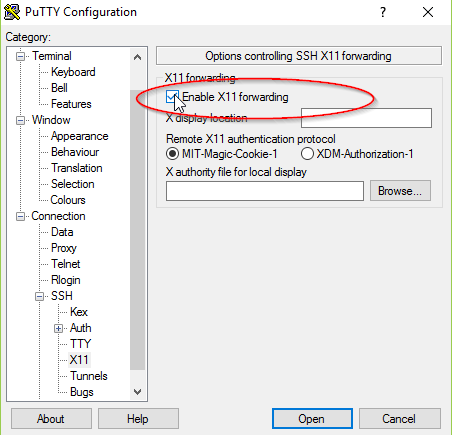
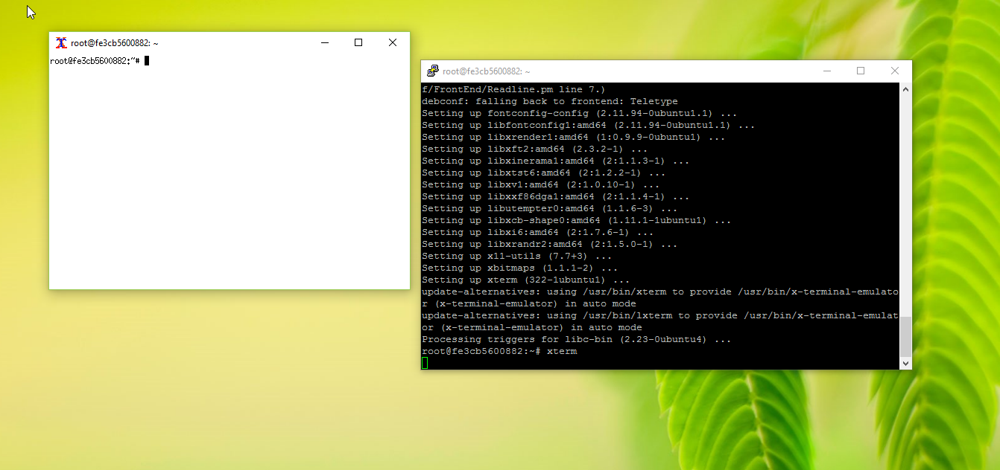

# Xvfb Ssh docker image


This repository give a Docker image for GUI applications on linux, 

This repository permit to run linux application with a remote XClient 

On windows, use XMing and Putty to display the application


## Build the image

clone the repo

```
git clone https://github.com/frett27/xvfbssh
```

build the docker image

```
docker build -t xvfbssh . 
```


## Launch a docker gui image


```
docker run -d -p 2424:22 --name ubuntugui  xvfbssh .
```


you can then connect with ssh and X11 forward to launch gui applications


## Connect to the docker image to run X applications from Windows

Using this docker image on windows, you will need 

- Putty : ssh client
- xming : X Client


Before launch the session, check if xming is running :




Connect to the docker image using putty on the proper given port :





don't forget to mention X Forwarding




the default login / password  are root / root 


you can then launch graphic applications


